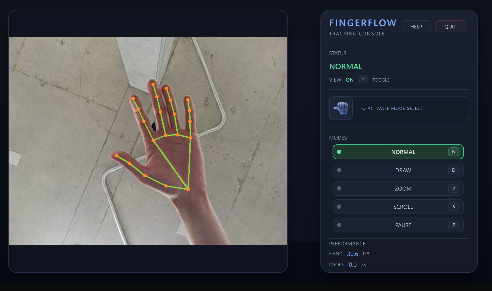

# FingerFlow

### Contrôlez votre ordinateur d’un simple geste de la main

Une expérience naturelle, sans contact et sans souris : FingerFlow transforme votre webcam en interface de contrôle.

## Une nouvelle façon d’interagir

FingerFlow vous permet de piloter votre ordinateur avec des mouvements simples et intuitifs. Grâce à la détection de la main en temps réel, déplacez le curseur, cliquez, naviguez et dessinez dans l’air — sans toucher votre clavier ni votre souris.

Pensé pour être fluide et accessible, FingerFlow associe vision par ordinateur et interface claire pour rendre chaque interaction plus naturelle.

## Tout contrôler du bout des doigts

- **Déplacer le curseur** en faisant simplement bouger votre main devant la webcam.
- **Cliquer** avec un pincement du pouce et de l’index.
- **Effectuer un clic droit** avec un pincement du pouce et du majeur.
- **Naviguer rapidement** grâce aux modes Zoom et Scroll.
- **Dessiner dans l’air** avec un mode dédié et des mouvements lissés.
- **Mettre l’application en pause** à tout moment, sans la fermer.

## Cinq modes pour chaque usage

### Mode Normal

Le mode principal pour déplacer le curseur et effectuer des clics au quotidien.

### Mode Dessin

Ouvrez Paint et dessinez naturellement avec votre main. Idéal pour esquisser, annoter ou expérimenter sans périphérique physique.

### Mode Zoom

Zoomez et dézoomez avec des pincements simples, pratique pour consulter des documents, des images ou des pages web.

### Mode Scroll

Faites défiler vos contenus sans toucher la souris : parcourez facilement une page, une liste ou un document.

### Mode Pause

Suspendez les interactions en un instant lorsque vous souhaitez garder la main sur votre écran ou faire une pause.

## Une interface claire et maîtrisée

La console FingerFlow affiche en temps réel le mode actif, l’état du suivi et les performances de la détection. Le bouton d’affichage permet également de garder la console visible ou de la masquer selon votre usage.

Les raccourcis clavier rendent le changement de mode immédiat :

| Touche | Mode |
| --- | --- |
| **N** | Normal |
| **D** | Dessin |
| **Z** | Zoom |
| **S** | Scroll |
| **P** | Pause |
| **T** | Afficher ou masquer la console |

## Une expérience plus naturelle

FingerFlow est conçu pour fonctionner avec une webcam standard et s’intégrer facilement à votre environnement Windows. Pour une détection optimale, utilisez l’application dans un espace bien éclairé, placez votre main à environ 30 à 60 cm de la caméra et privilégiez un arrière-plan dégagé.

## Prêt à essayer ?

1. Téléchargez **FingerFlow-Setup.exe** depuis la section **Releases** du projet.
2. Lancez l’installateur et suivez les instructions.
3. Ouvrez FingerFlow depuis le raccourci créé sur votre bureau.
4. Placez votre main devant la webcam et commencez à interagir.

Une webcam fonctionnelle et un ordinateur Windows sont nécessaires.

## FingerFlow en un coup d’œil

- Contrôle sans contact
- Détection de la main en temps réel
- Déplacement du curseur et clics par gestes
- Modes Dessin, Zoom, Scroll et Pause
- Interface moderne et suivi des performances
- Conçu pour Windows

---

**FingerFlow — vos gestes deviennent des commandes.**

